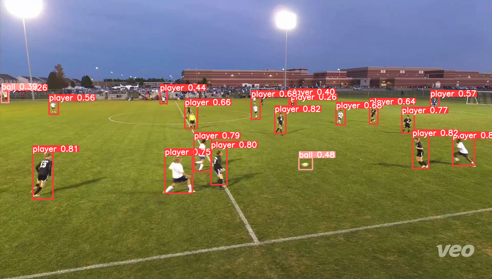
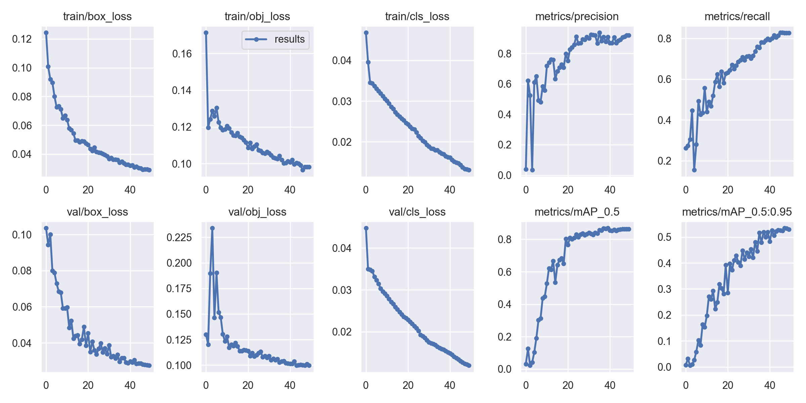
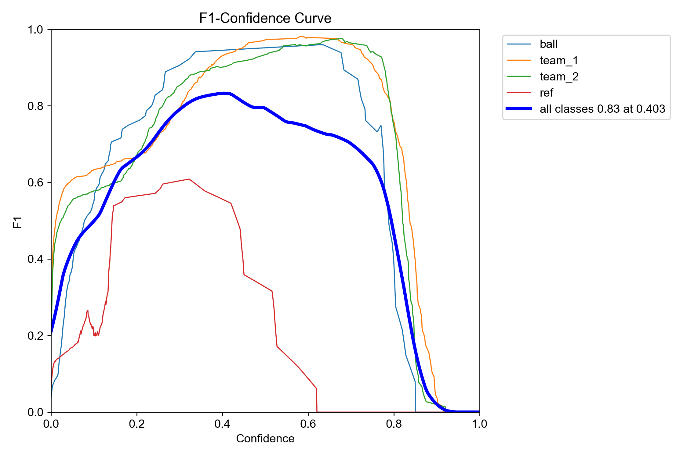
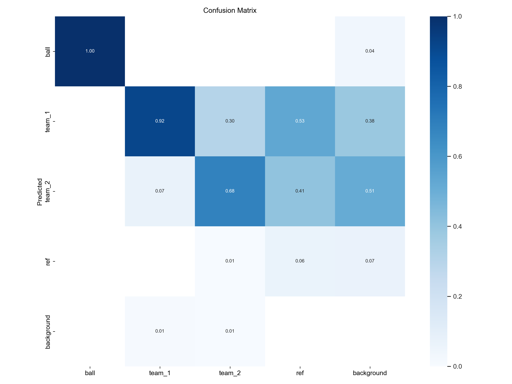

# Football Player and Element Detection with Deep Learning


This project explores the use of **deep learning techniques** to detect football players, referees, and the ball in images and to classify players into their respective teams based on their uniforms. It was developed as part of a collaboration with **Veo Technologies** during the *02456 Deep Learning course* at the **Technical University of Denmark (DTU)**.

The work evaluates and compares different state-of-the-art architectures, including **YOLOv5 (various sizes)**, **Faster R-CNN with ResNet-50 backbone**, and a **pre-trained VGG16** model, applied to football match footage recorded by the Veo Cam 2 system.



The goal was not only to detect and classify individual entities (players, referees, ball) but also to investigate methods for distinguishing teams via uniform colors, using both supervised and unsupervised approaches.

## ✨ Project Highlights

- 🤝 Collaboration with **Veo Technologies** on football analytics
- ⚡ Comparison of **one-stage (YOLOv5)** vs **two-stage (Faster R-CNN)** object detection methods
- 🧠 Experimentation with **pre-trained CNNs (VGG16)** for feature extraction
- ⚽ **Player, ball, and referee detection** from real match images
- 👕 **Team classification** using both:
  - Hand-labeled team datasets
  - Automatic labeling via unsupervised clustering of uniform colors (GMM vs KNN)
- 📊 Evaluation using **SoccerNet** and **Veo Cam 2** datasets
- 🎯 Focus on challenges such as **small/occluded objects**, **illumination variation**, and **camera perspective**

## 📂 Project Structure

```
├── Train.py                          # Training script (YOLOv5 / Faster R-CNN / VGG16)
├── Test.py                           # Model testing script
├── Run.py                            # End-to-end pipeline (train + test)
├── Dataset.py                        # Dataset handling and preprocessing
├── Data/
│   ├── Train/
│   │   ├── proj_det
│   │   ├── proj_gt
│   │   └── proj_img1
│   └── Test/
│       ├── proj_det
│       ├── proj_gt
│       └── proj_img1
├── trained_models/                   # Saved model weights
└── Deep_Learning_Final_Report.pdf   # Project report
```

## 🚀 Getting Started

### Quick Run Options

1. **Train a new model:**
   ```bash
   python Train.py
   ```
   *Generates a new trained model in the `trained_models/` directory*

2. **Test an existing model:**
   ```bash
   python Test.py
   ```
   *Evaluates the model on test data*

3. **Full pipeline:**
   ```bash
   python Run.py
   ```
   *Runs both training and testing in sequence*

## 📊 Results & Performance

### Training Progress

*Loss curves and training metrics over epochs*

### Model Performance Metrics

*F1-confidence curve showing model precision-recall balance*


*Detailed confusion matrix for class-wise performance analysis*

### Visual Detection Results
The models demonstrate strong performance across different scenarios:

**Player & Ball Detection Examples:**
- Faster R-CNN shows robust detection capabilities even with partially occluded players
- YOLOv5 provides real-time processing with competitive accuracy
- Both models handle varying lighting conditions and camera perspectives effectively

### Key Findings

- **🏃‍♂️ YOLOv5 Performance**  
  - ✅ **Real-time processing**: Up to **91 FPS** - ideal for live match analysis  
  - ✅ **Memory efficient**: Less computationally complex pipeline
  - ⚠️ **Small object challenge**: Slightly reduced accuracy on ball detection due to image downscaling
  - 📊 **Training efficiency**: Faster convergence with pre-trained weights

- **🎯 Faster R-CNN ResNet-50 Performance**  
  - ✅ **Superior small object detection**: Better ball recognition accuracy
  - ✅ **Two-stage precision**: RPN + classifier approach yields higher accuracy
  - ⚠️ **Computational cost**: Slower inference times, not suitable for real-time applications
  - 📈 **Theoretical advantage**: Better performance when computational resources aren't constrained

- **👕 Team Classification Innovation**  
  - ✅ **Supervised approach**: Reliable with hand-labeled team data
  - 🔄 **Unsupervised clustering**: GMM outperformed KNN for uniform color analysis
  - ⚠️ **Environmental sensitivity**: Performance affected by lighting conditions and background noise
  - 🎨 **Color-based methodology**: Novel approach using BGR color space clustering

- **👨‍⚖️ Detection Challenges**  
  - ⚠️ **Referee identification**: Most difficult due to visual similarity with players
  - ⚠️ **Goalkeeper classification**: Uniform color differences create labeling conflicts
  - 🔍 **Small/occluded objects**: Both models struggle with distant or partially hidden players
  - 📐 **Perspective issues**: Unusual camera angles affect bounding box prediction

### Technical Specifications

- **📊 Dataset**: 750 images from SoccerNet + Veo Cam 2 recordings
- **🖼️ Image Resolution**: 1080×1920 (rescaled for memory optimization)
- **🎯 Classes**: Ball, Player Team 1, Player Team 2, Referee/Others
- **⚙️ Training Details**: 
  - Batch size: 2 (hardware constraints)
  - Epochs: 8-40 (depending on task complexity)
  - Optimizer: SGD with dynamic learning rates
  - Augmentations: Horizontal flips, HSV transforms, rotations  

## 🧪 Technical Innovation

### Novel Methodologies Implemented

- **🎨 Automated Team Labeling**: Innovative unsupervised approach using BGR color space analysis
- **📊 Clustering Comparison**: GMM vs KNN algorithms for uniform color differentiation  
- **🔄 Hybrid Detection Pipeline**: Combined supervised and unsupervised learning approaches
- **⚡ Real-time Optimization**: Balanced accuracy vs speed for practical deployment

### Research Contributions

- **📈 Comprehensive Model Comparison**: Detailed analysis of one-stage vs two-stage detection methods
- **🏈 Sports Analytics Focus**: Specialized application to amateur football analysis
- **💡 Data Processing Innovation**: Automatic ball labeling using frequency and dimension filtering
- **🌍 Real-world Application**: Partnership with industry leader Veo Technologies

## 🏆 Project Achievement

### 🎯 **Perfect Score: 10/10**
This project received a **perfect score of 10/10** in the *02456 Deep Learning course* at DTU, demonstrating excellence in both technical implementation and research methodology.

### 🌟 Project Recognition
- **Industry Partnership**: Direct collaboration with Veo Technologies
- **Academic Excellence**: Top-tier performance in competitive Deep Learning course
- **Technical Innovation**: Novel approaches to sports video analysis
- **Practical Impact**: Real-world applicability to amateur sports analytics

## 🔬 Future Research Directions

Based on the project's findings, several promising avenues for future development were identified:

- **🔄 Hybrid Architecture**: Implement unsupervised clustering as a post-processing step after CNN detection
- **🏟️ Field Analysis**: Develop robust soccer field demarcation detection for 2D position mapping
- **👥 Multi-tracking**: Integrate temporal tracking for consistent player identification across frames
- **🎯 Specialized Models**: Develop goalkeeper-specific detection models to handle uniform variations
- **🌐 Dataset Expansion**: Scale to multiple camera angles and different lighting conditions
- **⚡ Edge Deployment**: Optimize models for real-time processing on edge devices

## 🚀 Impact & Applications

This project demonstrates the potential for automated football analysis systems that could:
- 📹 **Real-time Match Analytics**: Live performance statistics and tactical insights
- 📈 **Player Performance Tracking**: Individual and team performance metrics
- 🎥 **Automated Video Production**: Intelligent highlight generation and camera switching
- 📊 **Coaching Support**: Data-driven tactical analysis and training feedback
- 🏆 **Broadcasting Enhancement**: Augmented reality overlays and statistical graphics
- 📱 **Amateur Sports**: Democratizing professional-level analysis for grassroots football

---

## 👥 Team & Collaboration

**Project Team:**
- **Daniel Arriazu** (s212792)
- **Alberto Caregari** (s221794)  
- **Iván Serrano** (s212477)
- **Davide Venuto** (s220331)

**Industry Partnership:**
- 🤝 Direct collaboration with **Veo Technologies**
- 🎥 Access to **Veo Cam 2** recording system data
- 🏈 Real-world amateur football analysis challenges

## 📚 Documentation & Resources

📑 **[Full Project Report (PDF)](Deep_Learning_Final_Report.pdf)** - Complete technical documentation with detailed methodology and results

🔗 **[GitHub Repository](https://github.com/ivans14/Deep_Learning_Proj)** - Complete source code and implementation

**Course Information:**
- 🎓 Course: *02456 Deep Learning*, DTU Compute, Fall 2022
- 🏫 **Technical University of Denmark (DTU)**
- 👨‍🏫 Advanced computer vision and deep learning applications
